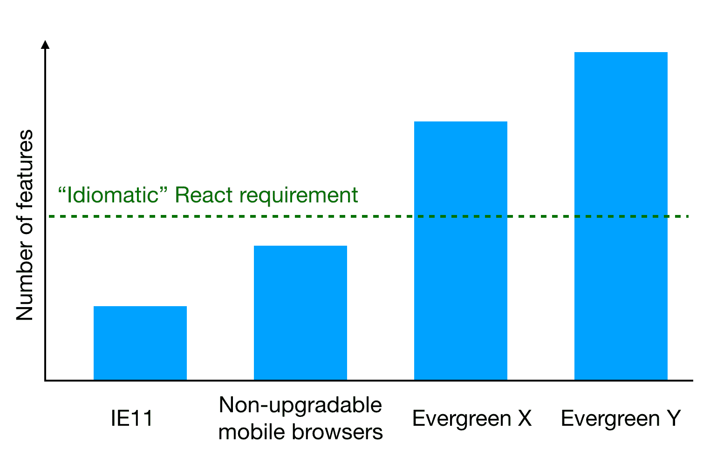

> A polyfill is a piece of code (usually JavaScript on the Web) used to provide modern functionality on older browsers that do not natively support it. - mdn, [source](https://developer.mozilla.org/en-US/docs/Glossary/Polyfill)

 on [Unsplash](https://unsplash.com/s/photos/thinking?utm_source=unsplash&utm_medium=referral&utm_content=creditCopyText)")

Support of JavaScript is not the same for all browsers nor are all common features in today's browsers present in older browsers (https://caniuse.com/ is an interesting site to explore to visualise the fragmented nature of feature support). Typically this difference originates due to browser vendors not completely aligned on all aspects of feature design but also because the web ecosystem continues to evolve and develop, leaving older browsers in a state of incompatibility with today.

Browser vendors have to update their products in order to keep up with developing ecmascript specifications (the spec for Javascript), improve and add features to support more and more feature-full applications (think location, camera, mic support) and loads more! This continued support gives advantages to the whole of web (developers, designers, publishers, users etc) everyone benefits from the web moving forward.

#:white_check_mark: Works in modern Chrome/Firefox/Safari:

```js
const result = ["traveller", "skyscanner", "partner"].includes("traveller")
// true
```

#:x: Does not work in IE11, [full support break down](https://caniuse.com/array-includes):

```js
const result = ["traveller", "sksycanner", "partner"].includes("traveller")
// Object doesn't support property or method 'includes'
```



Many web engineers around the world utilize a tool called [Babel](https://babeljs.io/). Babel is a compiler for javascript. It operates slightly differently to most compilers in that it transforms modern javascript to javascript that older browsers can also consume. Many large organisations have built extensive tooling around this idea of transforming new syntax into older syntax, a large ecosystem has been built by the web community making Babel a very powerful tool. This helps developers write modern javascript but ensure that their code will still execute on older/legacy browsers.

We are going to explore the Babel ecosystem as it is a key technology to understanding the range of options when examining legacy browser support. Mostly engineers don't have to think about how Babel works or what transformations are being applied, however, it is important that we understand the various different options available to us. We will examine several Babel transformations and discuss the advantages and disadvantages of the approaches in the context of polyfills.

An example of a typical (vanilla) Babel transformation is given below.

```js
// **input**

// es6 "arrow" syntax
const fn = () => "hello"

// instance method
const result = [].includes("oh")
```

```js
// **output**

"use strict"
// arrow syntax has been turned into a function
var fn = function fn() {
  return "hello"
}
// instance method
const result = [].includes("oh")
```

[[note]]
| Comments have been added post compilation to aid understanding. Sadly this code will not work in ie11. Note the "includes".

You can verify this yourself by going to: https://babeljs.io/repl and trying it out for yourself.

We can see from the above example that Babel can't solve everything for us. Although it does do a great job of transpiling syntax it can't handle certain language features (class/instance methods). The above has been compiled with vanilla Babel, no added configuration or plugins. In the plentiful ecosystem of Babel, is there something that can help us deal with things like "includes" calls?

Yes! #:tada: There are configurations (known as presets) in the babel ecosystem that let us do some really powerful things with our compilation step.

Let's explore a preset called ["preset-env"](https://babeljs.io/docs/en/babel-preset-env).

```js
// **input**

// es6 "arrow" syntax
const fn = () => "hello"

// instance method
[].includes("oh")
```

```js
// **output**

"use strict"

require("core-js/modules/es.array.includes")

var fn = function fn() {
  return "hello"
}

[].includes("oh")
```

[[note]]
| Compiled with `useBuiltIns: usage`. See: [Babel for more details](https://babeljs.io/docs/en/babel-preset-env#usebuiltins) browserlist: `[defaults,ie 11, ie_mob 11]`

We can now see that Babel has included an additional require, core-js. Core-js is a set of modules that provide various spec compliant implementations of browser features, also called "polyfills". We can see here that Babel has included the `es.array.includes` module for us without us having to lift a finger (not strictly true - but it's pretty simple). The act of "polyfilling" is to include code that acts as a polyfill for a single or a set of features.

How does Babel know that we want to polyfill this feature? I'll leave the details as an exercise for the reader, however, let's give a brief overview: By using more ecosystem tooling ([browserlist](https://github.com/browserslist/browserslist)) you may specify the target browsers that you wish to support in your application. Babel, in turn, uses this specification (with the aid of more tooling) to determine which features it needs to polyfill in your code to ensure that it runs correctly for the specified environment.

#:clap: **Can we just take a second to think how awesome that is?** #:clap:

You will be able to see that in this case we are "polyfilling on demand". When you utilize a function that requires a polyfill - Babel has you covered. This is the option known as **"usage"**.

This method has downsides. What happens when you consume (precompiled) 3rd party modules. Babel does not have the ability to polyfill on usage in this case as in the large majority of cases we let Babel ignore `node_modules` entirely. Uh oh... #:fire:

Let's look at another option of utilizing "useBuiltIns" with preset-env. **"Entry"**:

```js
// **input**

import "core-js/stable"

// es6 syntax
const fn = () => "hello"

// instance method
[].includes("oh")
```

```js
// **output**

"use strict"

require("core-js/modules/es.symbol")

require("core-js/modules/es.symbol.description")

require("core-js/modules/es.symbol.async-iterator")

require("core-js/modules/es.symbol.has-instance")

require("core-js/modules/es.symbol.is-concat-spreadable")

// ...
// lots of requires
// ...

// es6 syntax
var fn = function fn() {
  return "hello"
} // instance method

[].includes("oh")
```

[[note]]
| Compiled with `useBuiltIns: entry`. See: [Babel for more details](https://babeljs.io/docs/en/babel-preset-env#usebuiltins) Browserlist: `[defaults,ie 11, ie_mob 11]`

A few things have changed. Let's unpack them:

- A new import in our input. This is what is transformed by babel (note this import/require does not appear in the compiled output)
- There are multiple require statements in the compiled output not just the array require as in the last example.

In short, "entry" replaces the "core-js/stable" import with different core-js entry points based on the environment specified (by browserlist). Practically this means that every feature that needs polyfilled for the specified environment is included (whether you use it or not). This has the advantage that the 3rd party code you consume is also covered but has the disadvantage of being a significantly larger js payload, however, this guarantees platform stability.

It is clear that with a combination of polyfills and utilization of Babel we can achieve a stable platform to develop against.

If you have made it this far, congratulations!
We have covered quite a bit of ground here, let's do a short recap:

- We have explored the current state of the web & how this came to be
- We have introduced Babel, its abilities and its limitations
- We have explored a clever preset for Babel that has polyfilling support
- We have shown that this preset is not a silver bullet and comes with different trade offs

I've included further reading below that examines how we might start only using babel for older browsers and shipping es6 to moderns browsers.

**Resources for further reading:**

- [differential serving vs polyfill service how to best serve modern and legacy browsers](https://medium.com/@imdongchen/differential-serving-vs-polyfill-service-how-to-best-serve-modern-and-legacy-browsers-e5bb40ba73e8)
- https://babeljs.io/docs/en/babel-preset-env#targetsesmodules
- https://web.dev/serve-modern-code-to-modern-browsers
- https://jasonformat.com/modern-script-loading
- https://philipwalton.com/articles/deploying-es2015-code-in-production-today/
